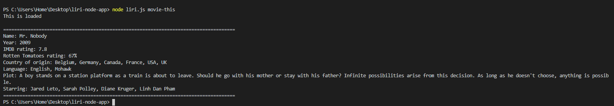
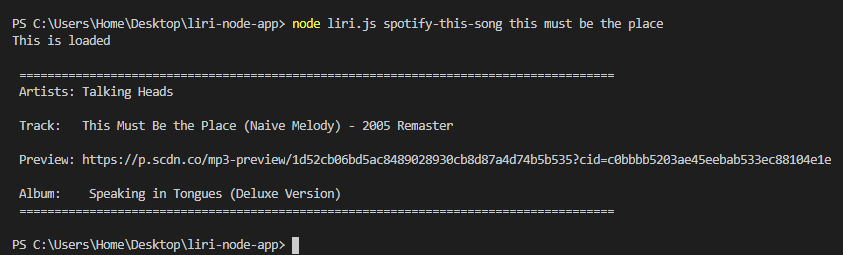

###Overview

This is a simple node.js application that I have wrote to demonstrate the use of several APIS. This app gathers information about either a music track, a movie, or a concert event. Additionally, it will be able to run these commands if they are written in a txt named random.txt.   

###Application structure
The app is dependent on the following packages: env, Axios and Spotify. 
There are several functions that either use Axios to ‘get’ response data from bandsintown or OMDB’s APIs, or in Spotify’s case its own package. Conditionals are used to detect which command the user would like to use and its respective function is called. The Spotify and movie function have their own default query if none is typed after the user command.

1.spotify-this-song
returns the artist of the song, the track name, a link to a short previewof the song, and its album

2.movie-this
returns the name of the show or film, the year it is released, its rating on IMDB and Rotten Tomatoes, its country of priduction, Language, a plot summery and a list of actors and actresses. 

3.concert-this
returns the name of the venue, the city it is taking place, and the date of the event 

###Instructions

After cloning repo, on the command line type npm I to download this app’s dependencies  
The following commands are accepted: 
node liri.js concert-this [music artist]
node liri.js spotify-this-song [song name]
node liri.js movie-this [movie name]
node liri.js do-what-it-says

note: for do-what-it-says, must have located in the folder’s root a txt file named random.txt. Within that file there must be a command and query separated by a ',' 

###Images of application in use

